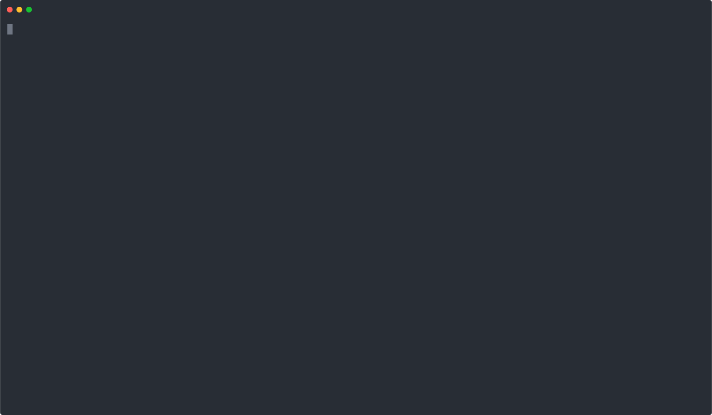

## DApps Using Meter

DApps are decentralized applications that utilize blockchains to store the history of operation. They can also consist of functional code that is published to the blockchain as well, called smart contracts, and like any other kind of application a DApp will have some kind of an interface, which might be a graphical, an API, or a command line client. DApps are generally related to money matters in some way, such as finance, exchange, and gambling, but social applications and games also exist. At the same time, there are numerous untapped opportunities to develop DApps for other categories that don't yet exist, or for which there are few DApps for at this time.

## Developing an Example DApp

The Meter blockchain provides a great foundation for creating DApps, using commonly used development tools for DApps on other blockchains, such as Ethereum. One prime example is that it is possible to communicate with Meter using the Web3 library thanks to the _Meterify_ interface.

As with any app, a DApp needs an identified use case. In the blockchain world the most common use case is a transaction where cryptocurrency is sent between two accounts, owned by Alice and Bob. It is very easy to create an example with Web3, where Alice wishes to send some Meter to Bob's account.  

There are two approaches below for building the app on Linux, one with Docker and one without.

### Building the Example on Linux Using Docker

**_Step 1:_** Ensure the latest version of `docker-compose` is installed.

```bash
$ sudo curl -L https://github.com/docker/compose/releases/download/1.24.1/docker-compose-`uname -s`-`uname -m` -o /usr/local/bin/docker-compose
$ sudo chmod +x /usr/local/bin/docker-compose
```

**_Step 2:_** Check that docker-compose was installed correctly.

```bash
$ docker-compose --version
docker-compose version 1.24.1, build 4667896b
```

**_Step 3:_** Create a project directory (e.g. `meter-dapp`).

```bash
$ mkdir meter-dapp
$ cd meter-dapp
```

**_Step 4:_** Initialize the app directory.

```bash
$ npm init
```

**_Step 5:_** Create a `docker-compose.yml` file.

```
version: '3.5'
services:
  node:
    image: "node:10"
    user: "node"
    working_dir: /home/node/meter-daap
    volumes:
      - ./:/home/node/meter-daap
    command: >
      sh -c "npm init &&
             npm i meterify --save &&
             npm i web3@1.0.0-beta.37 --save &&
             npm i solc@0.4.24 --save &&
             node index.js"
```

**_Step 6:_** Create a file called `index.js`, which will initially test the connection to the testnet.

```js
const meterify = require("meterify").meterify;
const Web3 = require("web3");
const web3 = meterify(new Web3(), "http://test.meter.io:8669");
```

**_Step 7:_** Run `docker-compose` to use the test application.

```bash
$ docker-compose up
```

**_Step 8:_** Stop Docker using `Ctrl+C`.

```bash
Ctrl+C
```

Continue to *Building the Main App* below the next section.

### Building the Example on Linux Without Docker

**_Step 1:_** Ensure Node.js version 10.15.1 or above is installed.

[Here is a guide](https://tecadmin.net/install-nodejs-with-nvm/#) on how to install Node.js and manage different versions.

**_Step 2:_** Create a project directory (e.g. `meter-dapp`).

```bash
$ mkdir meter-dapp
$ cd meter-dapp
```

**_Step 3:_** Initialize the app directory.

```bash
$ npm init
```

**_Step 4:_** Install the app prerequisites.

- [meterify](https://www.npmjs.com/package/meterify)
- [web3](https://www.npmjs.com/package/web3/v/1.0.0-beta.37) version 1.0.0-beta.37
- [solc](https://www.npmjs.com/package/solc/v/0.4.24) version 0.4.24

```bash
npm install meterify --save
npm install web3@1.0.0-beta.37 --save
npm install solc@0.4.24 --save
```

**_Step 5:_** Create a file called `index.js`, which will initially test the connection to the testnet.

```js
const meterify = require("meterify").meterify;
const Web3 = require("web3");
const web3 = meterify(new Web3(), "http://test.meter.io:8669");
```

**_Step 6:_** Run the test connection app.

```bash
$ node index.js
```

If the code above runs without any errors the connection was successful.

### Create the Application Functions

For the example please refer to this asciinema:



First, download a sample smart contract, which will be used by the app.

```bash
$ wget https://github.com/meterio/meterify/blob/master/test/sample_token.sol
```

Next, add each of the following function code snippets in every step to `index.js`.

**_Step 1:"_** Create two accounts, one for Alice and one for Bob.

```js
function createAccounts(){
  var accounts = {};
  accounts.alice = web3.eth.accounts.create();
  accounts.bob = web3.eth.accounts.create();
  return accounts;
}
```

**_Step 2:_** Add the account private keys from the `alice` and `bob` objects to the wallet.

```js
function addAccountsToWallet(accounts){
  web3.eth.accounts.wallet.add(alice.private_key);
  web3.eth.accounts.wallet.add(bob.private_key);
  web3.eth.accounts.wallet;
  return;
}
```

**_Step 3:_** Send MTR from Alice to Bob.

*Note:* The unit in `meterify` is Wei, where 1 MTR = 10e18 Wei.

```js
function send_MTR(accounts){
  web3.eth.sendTransaction(
    {
      from: accounts.alice.address,
      to: accounts.bob.address,
      value: '1000000000000000000',
      data: '00'
    }
  ).then(
    receipt => {}
  ).then(
    data => {
      console.log(data)
    }
  );
}
```

**_Step 4:_** Send MTRG from Alice to Bob.

*Note:* The unit in meterify is Wei, where 1 MTRG = 10e18 WeiG.

```js
function send_MTRG(accounts){
  web3.eth.sendTransaction(
    {
      from: accounts.alice.address,
      to: accounts.bob.address,
      value: '1000000000000000000',
      data: '01'
    }
  ).then(
    receipt => {
      console.log(receipt)
    }
  );
}
```

**_Step 5:_** Load the sample smart contract.

```js
function loadContract(file){
  const contractFile = fs.readFileSync(file).toString();
  const solc = require('solc');
  const compiledCode = solc.compile(contractFile);

  var data = {};

  data.token_abiDefinition = JSON.parse(compiledCode.contracts[':SAMPLEToken'].interface)
  let token_byteCode = compiledCode.contracts[':SAMPLEToken'].bytecode
  data.token_byteCode = "0x" + token_byteCode;

  return data;
}
```

**_Step 7:_** Deploy the contract byte code to blockchain.

```js
function deployContract(data,accounts){
  contractInstance = new web3.eth.Contract(data.token_abiDefinition)
  contractInstance.options.data = data.token_byteCode
  contractInstance.deploy(
    {
      arguments: [
        accounts.alice.address,
        '1000000000',
        'Sample Token',
        '3',
        'STOKEN'
      ]
    }
  ).send(
    {
      from: accounts.alice.address,
      gas: 4700000
    }
  ).then(
    (
      newContractInstance
    ) => {
      contractInstance.options.address = newContractInstance.options.address;
      registerEvents(contractInstance);
    }
  );
}
```

**_Step 8:_** Register contract events.

```js
function registerEvents(contractInstance){
  contractInstance.events.allEvents(
    {}, (error, result) => {
      if (error) {
          console.log(error)
      } else {
          console.log(result)
      }
  })
}
```

Some examples of calling contract's methods:

```js
contractInstance.methods._transferFrom(
  alice.address,
  bob.address,
  '9999'
).send(
  {
    from:alice.address,gas: 4700000
  }
).then(
  data => {
    console.log(data)}
  ).catch(
    err => {console.log(err)}
  )

contractInstance.methods.getAccountBalanceOf(
  alice.address
).send(
  {
    from: alice.address,
    gas: 4700000
  }).then(
    data => {
      console.log(data)
    }
  ).catch(err => {
    console.log(err)
  }
)

contractInstance.methods.mintToken(
  'some_address1',
  '99999999999999999999999'
).send(
  {
    from: 'some_address1',
    gas: 4700000
  }
).then(
  data => {
    console.log(data)
  }
).catch(
  err => {
    console.log(err)
  }
)

```
